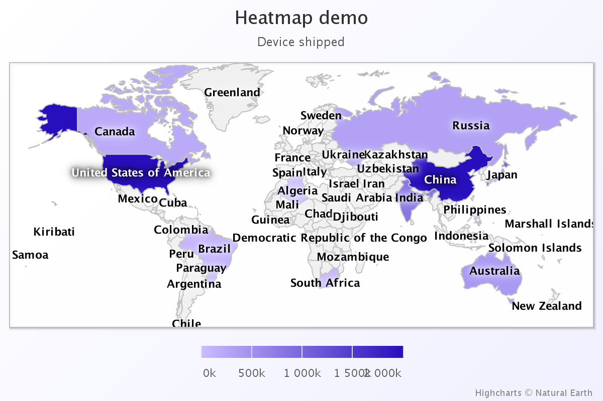
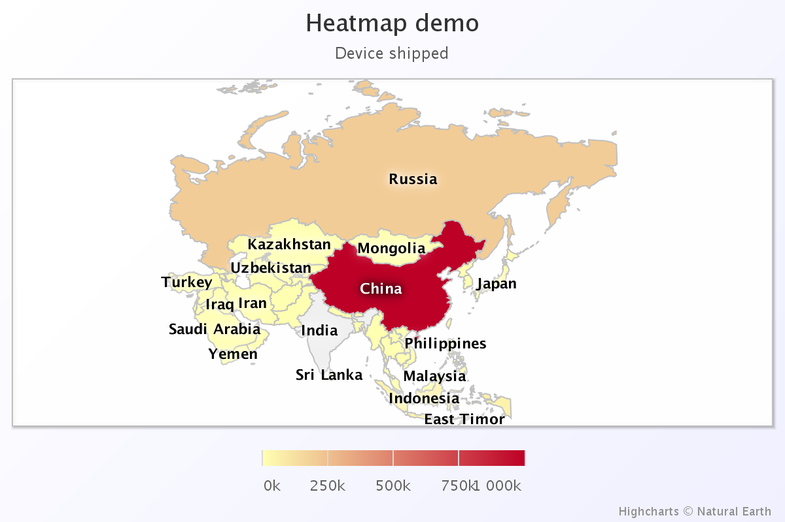
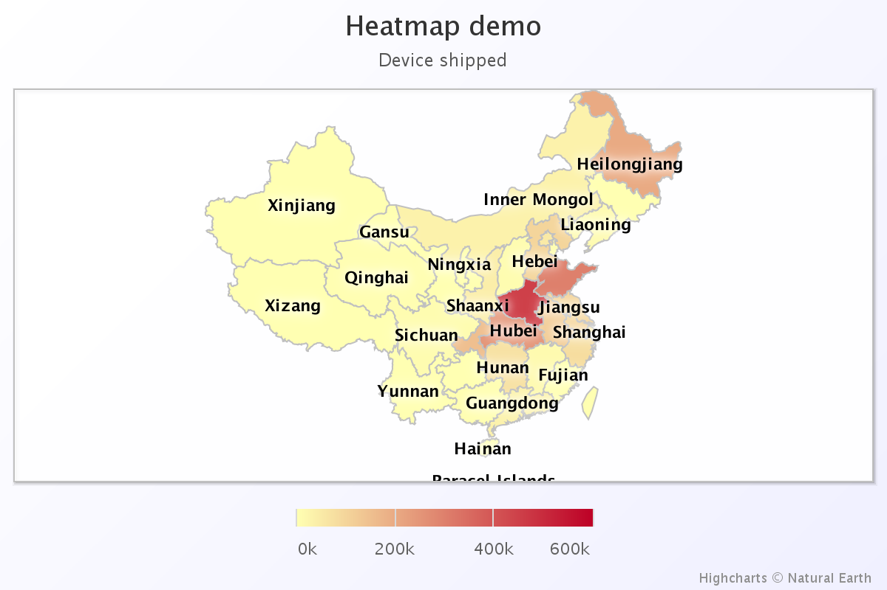

#Heat Map Generator
 A simple heat map (choropleth map) generator using HighMaps, supporting China, Asia, World map. Only running on browser, no web server required.
##Usage
 Extract anywhere and open index.html with a modern browser.
##Screenshots

##License
 MIT.
